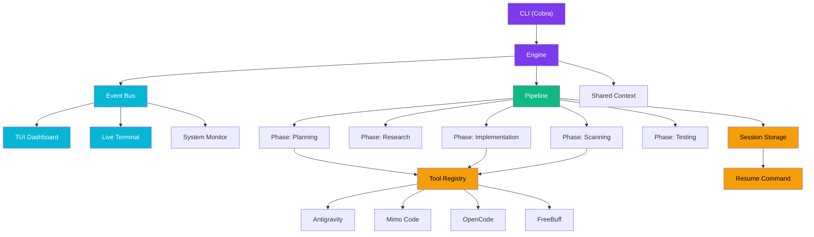

<p align="center">
  <pre>
   _____ _           _       _    _       _     
  / ____| |         (_)     | |  | |     | |    
 | |    | |__   __ _ _ _ __ | |__| |_   _| |__  
 | |    | '_ \ / _` | | '_ \|  __  | | | | '_ \ 
 | |____| | | | (_| | | | | | |  | | |_| | |_) |
  \_____|_| |_|\__,_|_|_| |_|_|  |_|\__,_|_.__/ 
  </pre>
  <br/>
  <strong>🔗 Multi-AI CLI Orchestrator</strong>
  <br/>
  <em>One pipeline. Multiple AI assistants. Zero chaos.</em>
  <br/><br/>
  <a href="#features">Features</a> •
  <a href="#installation">Installation</a> •
  <a href="#quick-start">Quick Start</a> •
  <a href="#supported-tools">Tools</a> •
  <a href="#commands">Commands</a> •
  <a href="#tui-dashboard">TUI</a> •
  <a href="#session-recovery">Recovery</a>
</p>

---

## What is ChainHub?

**ChainHub** is a CLI orchestrator that chains multiple AI-powered coding tools into a single, intelligent pipeline. Instead of switching between different AI assistants manually, ChainHub routes tasks to the right tool at the right phase — planning with one, coding with another, security-scanning with a third — then assembles the results into a cohesive workflow.

Think of it as a **conductor** for your AI orchestra.

---

## Features

| Feature | Description |
|---|---|
| 🔗 **Multi-tool pipelines** | Chain Antigravity → Mimo Code → OpenCode → FreeBuff in one command |
| 📊 **Live TUI dashboard** | Real-time view of pipeline progress, tool status, and system metrics |
| 🖥️ **Live Terminal view** | See real-time output from each AI tool as it works |
| 💾 **Session recovery** | Resume interrupted pipelines from where they stopped |
| 🔌 **Plugin system** | Drop-in YAML manifests to add new tools |
| 📡 **Event bus** | Pub/sub architecture for decoupled inter-tool communication |
| 🧠 **Shared context** | Persistent workspace context accessible by every tool |
| 🖥️ **System monitoring** | CPU, memory, and disk alerts baked in |
| ⚡ **Phase-based execution** | Planning → Research → Implementation → Scanning → Testing |
| 🎨 **Beautiful CLI** | Colored output, ASCII art, and a polished developer experience |

---

## Architecture



---

## Installation

### Prerequisites

- **Go 1.22+**
- At least one supported AI CLI tool installed

### From Source

```bash
git clone https://github.com/khurafati/chainhub.git
cd chainhub

# Build
make build

# Or install globally
make install
```

### Quick Install

```bash
go install github.com/khurafati/chainhub/cmd/chainhub@latest
```

---

## Quick Start

```bash
# 1. Initialize a workspace
chainhub init

# 2. Connect your AI tools
chainhub connect antigravity
chainhub connect mimo-code
chainhub connect opencode
chainhub connect freebuff

# 3. Run a pipeline
chainhub run "Build a REST API for user authentication with JWT tokens"

# 4. Press 4 to see Live Terminal view ✨
```

---

## Supported Tools

| Tool | Binary | Specialties | Description |
|---|---|---|---|
| **Antigravity** | `agy` | Coding, Planning, Scanning | Google's advanced agentic coder |
| **Mimo Code** | `mimo` | Coding, Implementation | Focused implementation engine |
| **OpenCode** | `opencode` | Coding, Research | Open-source code assistant |
| **FreeBuff** | `freebuff` | Scanning, Security | Security scanning & analysis |

### Adding Custom Tools

Place a YAML manifest in the `plugins/` directory:

```yaml
# plugins/my-tool.yaml
name: my-tool
display_name: My Custom Tool
command: my-tool-binary
args: ["--headless"]
specialties:
  - coding
  - testing
priority: medium
```

---

## Commands

### Core Commands

| Command | Description |
|---|---|
| `chainhub init` | Initialize a new workspace |
| `chainhub connect <tool>` | Register an AI tool |
| `chainhub run "<problem>"` | Start pipeline + TUI |
| `chainhub resume` | Resume last interrupted session |
| `chainhub sessions` | List all saved sessions |
| `chainhub status` | Show current status |
| `chainhub tools list` | List available tools |
| `chainhub pipeline show` | Show pipeline details |
| `chainhub assign <phase> <tool>` | Assign tool to phase |
| `chainhub mode <auto\|manual>` | Switch orchestration mode |
| `chainhub version` | Print version info |

### Run Options

```bash
# Run with TUI (interactive terminal)
chainhub run "Build a todo app"

# Run headless (no TUI)
chainhub run --no-tui "Build a todo app"

# Verbose output
chainhub run --verbose "Build a todo app"

# Custom config
chainhub run --config ./my-config.yaml "Build a todo app"
```

### Session Recovery

```bash
# List all saved sessions
chainhub sessions

# Resume the last session
chainhub resume

# Output:
# 📋 Saved Sessions
#   1. running Build a todo app (40%)
#      ID: c28da5d6 | Phases: 2/5 completed
```

---

## TUI Dashboard

The interactive TUI has **4 views**:

### Tab 1: Dashboard
Live overview with pipeline progress, connected tools, system metrics, and recent events.

### Tab 2: Pipeline
Detailed phase-by-phase breakdown with assigned tools, status indicators, and progress tracking.

### Tab 3: Logs
Full event log with timestamps, color-coded event types, source tools, and payload summaries.

### Tab 4: Live Terminal ⭐
**See real-time output from each AI tool as it works!**

- Switch between tools with `←` `→` arrows
- Watch code being written in real-time
- See errors and output as they happen

### Keybindings

| Key | Action |
|---|---|
| `q` / `Ctrl+C` | Quit |
| `Tab` | Cycle through views |
| `1` | Jump to Dashboard |
| `2` | Jump to Pipeline |
| `3` | Jump to Logs |
| `4` | Jump to Live Terminal |
| `←` `→` | Switch between tools (Terminal view) |
| `Space` / `n` | Advance to next phase |

---

## Session Recovery

ChainHub automatically saves your pipeline state so you can resume if anything stops.

### How It Works

1. **Auto-save** — State saved on every phase advance
2. **Latest session** — Always accessible via `chainhub resume`
3. **Full history** — All sessions saved in `.chainhub/sessions/`

### Example Workflow

```bash
# Start a project
chainhub run "Build a blog website"

# Oops! Pipeline stops (Ctrl+C, crash, timeout)
# ...

# Check what you had
chainhub sessions
# 📋 Saved Sessions
#   1. running Build a blog website (60%)

# Resume from where it stopped
chainhub resume
# 🔗 ChainHub — Resuming Session
#   → Resuming pipeline: Build a blog website
#   → Current phase: scanning
```

### Session Files

```
.chainhub/sessions/
├── latest.json      # Most recent session
├── abc123-def456.json  # Session by ID
└── ...
```

---

## Configuration

### `configs/default.yaml`

```yaml
chainhub:
  version: "1.0.0"
  workspace: ".chainhub"
  log_level: "info"

  pipeline:
    default_phases:
      - planning
      - research
      - implementation
      - scanning
      - testing
    feedback_loops: true
    max_concurrent_tools: 3
    mode: auto

  monitor:
    interval: "5s"
    alerts:
      cpu_threshold: 85
      memory_threshold: 80
      disk_threshold: 90
```

### `configs/tools.yaml`

```yaml
tools:
  - name: antigravity
    command: agy
    enabled: true
  - name: mimo-code
    command: mimo
    enabled: true
  - name: opencode
    command: opencode
    enabled: true
  - name: freebuff
    command: freebuff
    enabled: true
```

---

## Pipeline Phases

| # | Phase | Purpose | Default Tools |
|---|---|---|---|
| 1 | **Planning** | Break down the problem | Antigravity |
| 2 | **Research** | Gather context | OpenCode |
| 3 | **Implementation** | Write the code | Mimo Code |
| 4 | **Scanning** | Security analysis | FreeBuff |
| 5 | **Testing** | Verify correctness | Antigravity |

---

## Project Structure

```
chainhub/
├── cmd/chainhub/          # CLI entry point
│   └── main.go
├── internal/
│   ├── adapter/           # Tool adapters & registry
│   ├── context/           # Shared workspace context
│   ├── core/              # Engine, pipeline, config
│   ├── eventbus/          # Pub/sub event system
│   ├── monitor/           # System monitoring
│   ├── plugin/            # Plugin loader
│   └── tui/               # Terminal UI
│       ├── app.go         # Main model
│       ├── dashboard.go   # Dashboard view
│       ├── pipeline_view.go
│       ├── log_view.go
│       ├── terminal_view.go  # Live terminal
│       └── styles.go
├── configs/               # Configuration
├── plugins/               # Plugin manifests
├── workspace/             # Working directory
└── .chainhub/
    ├── sessions/          # Saved sessions
    ├── logs/              # Engine logs
    └── context/           # Shared context
```

---

## Development

```bash
make build        # Build binary
make test         # Run tests
make fmt          # Format code
make lint         # Run linter
make dev          # Development run
```

---

## License

MIT License — Copyright (c) 2026 Khurafati

---

<p align="center">
  <strong>Built with 💜 by Khurafati</strong>
  <br/>
  <em>Making AI assistants work together, not against each other.</em>
</p>
