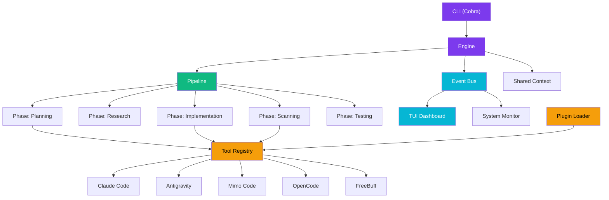

<p align="center">
  <pre>
   _____ _           _       _    _       _     
  / ____| |         (_)     | |  | |     | |    
 | |    | |__   __ _ _ _ __ | |__| |_   _| |__  
 | |    | '_ \ / _` | | '_ \|  __  | | | | '_ \ 
 | |____| | | | (_| | | | | | |  | | |_| | |_) |
  \_____|_| |_|\__,_|_|_| |_|_|  |_|\__,_|_.__/ 
  </pre>
  <br/>
  <strong>🔗 Multi-AI CLI Orchestrator</strong>
  <br/>
  <em>One pipeline. Multiple AI assistants. Zero chaos.</em>
  <br/><br/>
  <a href="#features">Features</a> •
  <a href="#installation">Installation</a> •
  <a href="#quick-start">Quick Start</a> •
  <a href="#supported-tools">Tools</a> •
  <a href="#configuration">Config</a> •
  <a href="#plugins">Plugins</a> •
  <a href="#contributing">Contributing</a>
</p>

---

## What is ChainHub?

**ChainHub** is a CLI orchestrator that chains multiple AI-powered coding tools into a single, intelligent pipeline. Instead of switching between different AI assistants manually, ChainHub routes tasks to the right tool at the right phase — planning with one, coding with another, security-scanning with a third — then assembles the results into a cohesive workflow.

Think of it as a **conductor** for your AI orchestra.

---

## Features

| Feature | Description |
|---|---|
| 🔗 **Multi-tool pipelines** | Chain Claude Code → Antigravity → FreeBuff in one command |
| 📊 **Live TUI dashboard** | Real-time view of pipeline progress, tool status, and system metrics |
| 🔌 **Plugin system** | Drop-in YAML manifests to add new tools |
| 📡 **Event bus** | Pub/sub architecture for decoupled inter-tool communication |
| 🧠 **Shared context** | Persistent workspace context accessible by every tool |
| 🖥️ **System monitoring** | CPU, memory, and disk alerts baked in |
| ⚡ **Phase-based execution** | Planning → Research → Implementation → Scanning → Testing |
| 🎨 **Beautiful CLI** | Colored output, ASCII art, and a polished developer experience |

---

## Architecture



---

## Installation

### Prerequisites

- **Go 1.22+**
- At least one supported AI CLI tool installed

### From Source

```bash
git clone https://github.com/khurafati/chainhub.git
cd chainhub

# Build
make build

# Or install globally
make install
```

### Quick Install

```bash
go install github.com/khurafati/chainhub/cmd/chainhub@latest
```

---

## Quick Start

```bash
# 1. Initialize a workspace
chainhub init

# 2. Connect your AI tools
chainhub connect claude-code
chainhub connect antigravity
chainhub connect freebuff

# 3. Run a pipeline
chainhub run "Build a REST API for user authentication with JWT tokens"

# 4. Watch the magic in the TUI dashboard ✨
```

The TUI will launch automatically, showing:
- 📊 Live pipeline progress
- 🛠️ Connected tool statuses
- 📡 Real-time event stream
- 🖥️ System resource usage

---

## Supported Tools

| Tool | Binary | Specialties | Description |
|---|---|---|---|
| **Claude Code** | `claude` | Planning, Coding, Review | Anthropic's AI coding assistant |
| **Antigravity** | `agy` | Coding, Planning, Scanning | Google's advanced agentic coder |
| **Mimo Code** | `mimo` | Coding, Implementation | Focused implementation engine |
| **OpenCode** | `opencode` | Coding, Research | Open-source code assistant |
| **FreeBuff** | `freebuff` | Scanning, Security | Security scanning & analysis |

### Adding Custom Tools

Place a YAML manifest in the `plugins/` directory:

```yaml
# plugins/my-tool.yaml
name: my-tool
display_name: My Custom Tool
command: my-tool-binary
args: ["--headless"]
specialties:
  - coding
  - testing
priority: medium
```

---

## CLI Commands

```
chainhub                       # Show help
chainhub init                  # Initialize workspace
chainhub connect <tool>        # Register an AI tool
chainhub assign <phase> <tool> # Assign tool to phase (enables manual mode)
chainhub mode <auto|manual>     # Switch orchestration mode
chainhub run "<problem>"       # Start pipeline + TUI
chainhub status                # Show current status
chainhub tools list            # List available tools
chainhub pipeline show         # Show pipeline details
chainhub version               # Print version info
```

### Global Flags

| Flag | Default | Description |
|---|---|---|
| `--config` | `./configs/default.yaml` | Configuration file path |
| `--verbose` | `false` | Enable verbose output |

---

## Configuration

ChainHub uses YAML configuration files stored in the `configs/` directory.

### `configs/default.yaml`

```yaml
chainhub:
  version: "1.0.0"
  workspace: ".chainhub"
  log_level: "info"

  pipeline:
    default_phases:
      - planning
      - research
      - implementation
      - scanning
      - testing
    feedback_loops: true
    max_concurrent_tools: 3
    mode: auto                  # auto | manual
    phase_assignments: {}       # maps phase to tool name in manual mode

  monitor:
    interval: "5s"
    alerts:
      cpu_threshold: 85
      memory_threshold: 80
      disk_threshold: 90

  event_bus:
    type: "memory"
    buffer_size: 100

  context:
    share_method: "file"
    reports_dir: "reports"
```

### `configs/tools.yaml`

```yaml
tools:
  - name: "claude-code"
    display_name: "Claude Code"
    command: "claude"
    args:
      - "--dangerously-skip-permissions"
    specialties:
      - implementation
      - research
      - planning
    supported_phases:
      - planning
      - research
      - implementation
      - testing
    health_check:
      command: "claude"
      args: ["--version"]
    priority: 1
    enabled: true
  - name: "antigravity"
    display_name: "Antigravity CLI"
    command: "agy"
    args: []
    specialties:
      - research
      - planning
      - scanning
    supported_phases:
      - planning
      - research
      - scanning
      - testing
    health_check:
      command: "agy"
      args: ["--version"]
    priority: 2
    enabled: true
```

---

## Pipeline Phases

Every pipeline progresses through five phases:

| # | Phase | Purpose | Default Tools |
|---|---|---|---|
| 1 | **Planning** | Break down the problem, create a plan | Claude Code, Antigravity |
| 2 | **Research** | Gather context, analyze codebase | OpenCode, Claude Code |
| 3 | **Implementation** | Write the actual code | Antigravity, Mimo Code |
| 4 | **Scanning** | Security & quality analysis | FreeBuff, Antigravity |
| 5 | **Testing** | Verify correctness | Claude Code, Antigravity |

---

## Plugin Development

### Manifest Format

```yaml
name: example-tool          # Unique identifier
display_name: Example Tool  # Human-readable name
command: example-cli         # Binary name
args:                        # Default arguments
  - "--mode"
  - "headless"
specialties:                 # Capabilities
  - coding
  - testing
priority: medium             # low | medium | high | critical
```

### Available Specialties

- `planning` — Strategic task decomposition
- `coding` — Code generation & editing
- `scanning` — Security & quality scanning
- `testing` — Test creation & execution
- `research` — Information gathering
- `review` — Code review & feedback
- `documentation` — Doc generation

---

## TUI Dashboard

The interactive TUI dashboard provides three views:

### Dashboard (Tab 1)
Live overview with pipeline progress, connected tools, system metrics, and recent events.

### Pipeline (Tab 2)
Detailed phase-by-phase breakdown with assigned tools, status indicators, and progress tracking.

### Logs (Tab 3)
Full event log with timestamps, color-coded event types, source tools, and payload summaries.

### Keybindings

| Key | Action |
|---|---|
| `q` / `Ctrl+C` | Quit |
| `Tab` | Cycle through views |
| `1` | Jump to Dashboard |
| `2` | Jump to Pipeline |
| `3` | Jump to Logs |

---

## Project Structure

```
chainhub/
├── cmd/
│   └── chainhub/
│       └── main.go              # CLI entry point (Cobra)
├── internal/
│   ├── adapter/                 # Tool adapter interfaces & registry
│   ├── context/                 # Shared workspace context
│   ├── core/                    # Engine, pipeline, config
│   ├── eventbus/                # Pub/sub event system
│   ├── monitor/                 # System resource monitoring
│   ├── plugin/                  # Plugin loader
│   └── tui/                     # Terminal UI (Bubbletea)
│       ├── app.go               # Main TUI model
│       ├── dashboard.go         # Dashboard view
│       ├── log_view.go          # Log view
│       ├── pipeline_view.go     # Pipeline detail view
│       └── styles.go            # Lipgloss styles & palette
├── configs/                     # Configuration files
├── plugins/                     # Plugin manifests
├── workspace/                   # Working directory for pipelines
├── Makefile                     # Build & dev commands
├── README.md                    # This file
├── go.mod
└── go.sum
```

---

## Development

```bash
# Format code
make fmt

# Run linter
make lint

# Run tests
make test

# Run tests with coverage
make test-cover

# Tidy modules
make mod

# Development run
make dev
```

---

## Contributing

Contributions are welcome! Here's how to get started:

1. **Fork** the repository
2. **Create** a feature branch: `git checkout -b feat/my-feature`
3. **Commit** your changes: `git commit -m "feat: add my feature"`
4. **Push** to the branch: `git push origin feat/my-feature`
5. **Open** a Pull Request

### Guidelines

- Follow Go conventions and `go fmt`
- Add tests for new functionality
- Update documentation for user-facing changes
- Use [Conventional Commits](https://www.conventionalcommits.org/)

---

## License

MIT License — see [LICENSE](LICENSE) for details.

```
MIT License

Copyright (c) 2026 Khurafati

Permission is hereby granted, free of charge, to any person obtaining a copy
of this software and associated documentation files (the "Software"), to deal
in the Software without restriction, including without limitation the rights
to use, copy, modify, merge, publish, distribute, sublicense, and/or sell
copies of the Software, and to permit persons to whom the Software is
furnished to do so, subject to the following conditions:

The above copyright notice and this permission notice shall be included in all
copies or substantial portions of the Software.

THE SOFTWARE IS PROVIDED "AS IS", WITHOUT WARRANTY OF ANY KIND, EXPRESS OR
IMPLIED, INCLUDING BUT NOT LIMITED TO THE WARRANTIES OF MERCHANTABILITY,
FITNESS FOR A PARTICULAR PURPOSE AND NONINFRINGEMENT. IN NO EVENT SHALL THE
AUTHORS OR COPYRIGHT HOLDERS BE LIABLE FOR ANY CLAIM, DAMAGES OR OTHER
LIABILITY, WHETHER IN AN ACTION OF CONTRACT, TORT OR OTHERWISE, ARISING FROM,
OUT OF OR IN CONNECTION WITH THE SOFTWARE OR THE USE OR OTHER DEALINGS IN THE
SOFTWARE.
```

---

<p align="center">
  <strong>Built with 💜 by Khurafati</strong>
  <br/>
  <em>Making AI assistants work together, not against each other.</em>
</p>
